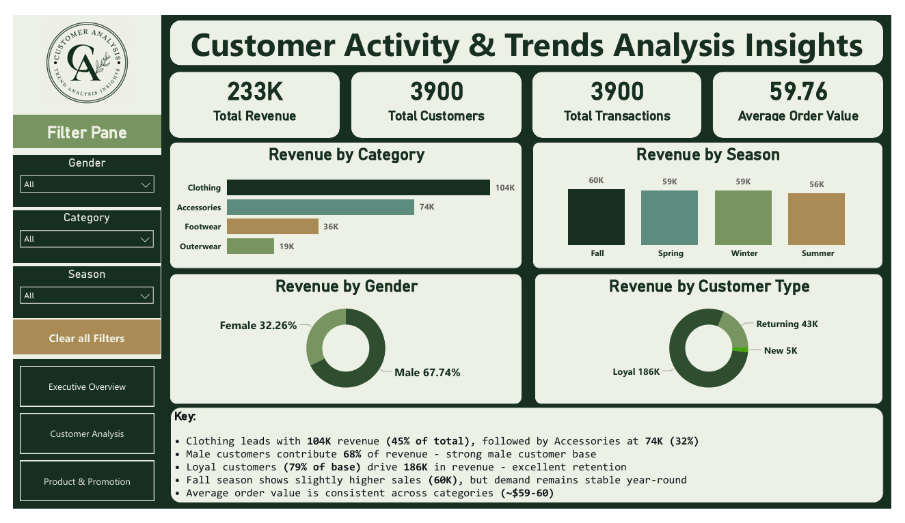
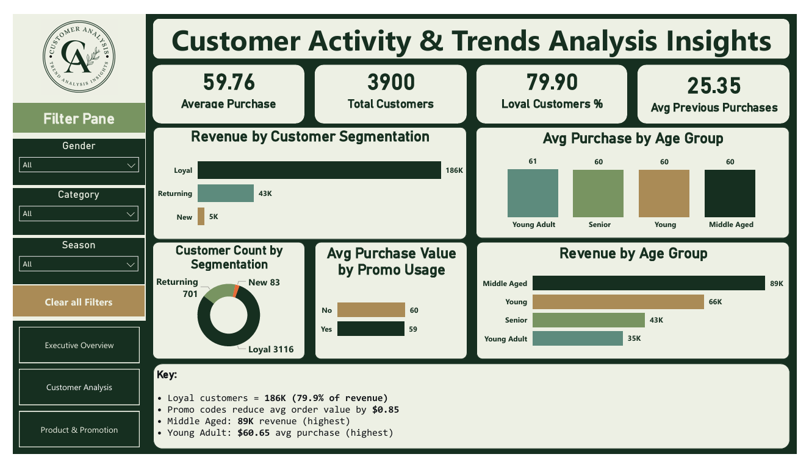
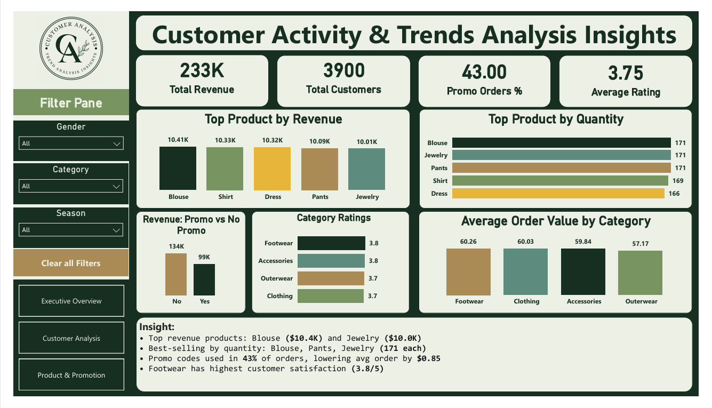

#  Customer Shopping Behavior Analysis


---

## 📌 Executive Summary

This project analyzes customer shopping behavior to identify key patterns in purchasing trends, customer segments, and product performance. Using Python, SQL, and Power BI, the project performs data cleaning, exploratory data analysis, and visualization to generate meaningful business insights. The results help understand customer behavior, top-performing product categories, and factors influencing sales performance.

## 📋 Project Overview

This project analyzes customer shopping behavior to identify patterns in purchasing trends, customer demographics, product performance, and seasonal sales. The goal is to generate actionable insights that can help businesses improve marketing strategies, customer retention, and product planning.
The project includes a complete data analytics workflow, starting from raw data processing to business intelligence dashboard creation.

---

## 🧩 Business Problem

### Retail businesses collect large amounts of customer transaction data, but this data is often underutilized. Without proper analysis, companies struggle to understand:
  - Which products generate the most revenue
  - Which customer segments contribute the most to sales
  - How purchasing behavior varies across age groups and seasons
  - Whether promotional campaigns and discounts influence purchasing decisions
This project addresses these challenges by analyzing customer shopping data to identify important trends and insights that can support better marketing strategies, customer targeting, and product planning.

## 📊 Dataset Description
### The dataset used in this project contains customer shopping transaction data, including demographic information, product purchase details, and customer behavior patterns. It allows analysis of purchasing trends, customer segments, and product performance.
  ## Key Features:
    Customer demographics (Age, Gender, Location, Subscription Status)
    Purchase details (Item Purchased, Category, Purchase Amount, Season, Size, Color)
    Shopping behavior (Discount Applied, Promo Code Used, Previous Purchases, Frequency of Purchases, Review Rating, Shipping Type)
## 🎯 Key stages of the project include:
  - ✅ Data cleaning and preprocessing 
  - ✅ Feature engineering 
  - ✅ Automated data pipeline using Python  
  - ✅ SQL analysis for business insights 
  - ✅ Exploratory Data Analysis (EDA)
  - ✅ Interactive dashboard development using Power BI

---
## 🎯 Project Objectives 

### The primary objectives of this project are:
 - Understand **customer purchasing behavior**
 - Identify **top performing product categories**
 - Analyze **customer segments and loyalty**
 - Evaluate **seasonal sales trends**
 - Measure the impact of **promotions and discounts**
 - Build a **business dashboard** for decision making


### 🛠 Tools & Technologies
The following tools and technologies were used in this project:
### Programming & Data Processing
 - Python
 - Pandas
 - Numpy
### Data Visualization
 - Matplotlib
 - Seaborn
 - Power BI
### Database
 - MySQL
### Development Environment
 - Jupyter Notebook
     
---

## 📁 Project Structure

```
customer-behavior-analysis/
│
├── data/
│ ├── raw/
│ │ └── customer_shopping_behavior.csv
│
├── notebooks/
│ ├── data_cleaning.ipynb
│ └── sql.ipynb
│
├── dashboard/
│ └── powerbi_dashboard.pbix
│
├── reports/
│ └── Project_Report.pdf
│
├── script/
│ ├── customer_data_pipeline.py
│
├── logs/
│ └── pipeline.log
|
├── images/
│ └── customer_analysis.png
│ └── executive_overview.png
│ └── product_promotion.png
│
├── requirements.txt
├── README.md
├── LICENSE
└── .gitignore
```

## 🔄 Data Pipeline Workflow
A Python-based **data pipeline** was developed to automate the data preparation process.

### Key Pipeline Features:
- ✅ Load raw dataset from CSV
- ✅ Clean and standardize column names
- ✅ Perform feature engineering
- ✅ Segment customers based on purchase history
- ✅ Store the cleaned dataset into a MySQL database
- ✅ Log pipeline execution for monitoring
### Pipeline technologies:
 - Python
 - Pandas
 - MYSQL
 - Logging
   
---

## 🧹 Data Cleaning
### Several preprocessing steps were applied to ensure data quality:
 - Standardized column names
 - Handled missing values using:
   - Median imputation for numeric columns
   - Mode imputation for categorical columns
 - Converted data types where necessary
 - Removed inconsistencies in categorical values
These steps ensure the dataset is analysis-ready.

## 🧠 Feature Engineering
Additional features were created to enhance analysis.
### Age Group
Customers were categorized into age groups:
| Age Range| Group |
|---------|-------|
| 0-25 | Young Adult | 
| 26-40 | Young |
| 41-60 |Middle Aged |
| 60+ | Senior |

### Customer Segmentation
Customers were segmented based on previous purchase behavior:
|Segment|	Criteria|
|-------|---------|
New|	1 purchase|
Returning|	2–10 purchases|
Loyal	|More than 10 purchases|

This segmentation helps analyze customer loyalty and revenue contribution.

## 📊 Exploratory Data Analysis (EDA)
Exploratory analysis was performed using Python and visualization libraries to identify patterns and trends.
### Key analyses included:
 - Revenue by product category
 - Revenue by customer gender
 - Customer segmentation analysis
 - Average purchase amount by age group
 - Seasonal sales trends
 - Promotion and discount impact
 - Purchase frequency patterns
 - Visualizations were created using Matplotlib and Seaborn.

---

## 🗃 SQL Analysis
SQL queries were written to perform additional analysis on the cleaned dataset stored in MySQL.
### Examples of SQL analysis include:
  - Top revenue generating products
  - Revenue by customer segment
  - Category performance analysis
  - City-wise revenue ranking
 - Purchase frequency analysis
SQL window functions and aggregations were used to derive insights.
```sql
-- Category Revenue Analysis
SELECT category, SUM(purchase_amount) AS total_revenue
FROM clean_customer_data
GROUP BY category
ORDER BY total_revenue DESC;

-- Top Products by Category
WITH top_ranked_items AS (
    SELECT category, item_purchased, SUM(purchase_amount) AS total_revenue,
           RANK() OVER (PARTITION BY category ORDER BY SUM(purchase_amount) DESC) AS rank
    FROM clean_customer_data
    GROUP BY category, item_purchased
)
SELECT category, item_purchased, total_revenue
FROM top_ranked_items
WHERE rank = 1;
```

---

## 📈 Power BI Dashboard
A multi-page Power BI dashboard was created to present business insights visually.
### Dashboard pages include:
### 1️⃣ Executive Overview
  - Total Revenue
  - Total Customers
  - Total Transactions
  - Revenue by Category
  - Revenue by Season
  - Revenue by Gender



---

### 2️⃣ Customer Analysis
 - Revenue by Customer Segment
 - Customer Distribution
 - Revenue by Age Group
 - Average Purchase Amount by Age Group
 - Promotion Impact Analysis



---

### 3️⃣ Product & Promotion Analysis
  - Top Products by Revenue
  - Category Ratings
  - Promotion vs Non-Promotion Revenue
  - Average Order Value by Category



---

## 🔍 Key Insights
### The analysis of 3,900 customers and $233K total revenue revealed the following:
 - **Clothing dominates revenue —** generating $104K (45% of total), nearly 3x more than Footwear ($36K) and 5x more than Outerwear ($19K)
 - **Loyal customers are the business backbone —** 3,116 loyal customers (79.9% of base) drive $186K in revenue, while 83 new customers generate only $5K total
 - **Middle-aged customers are the highest-value segment —** contributing $89K in revenue, 35% more than the Young segment ($66K)
 - **Promotions have minimal ROI —** promo codes are used in 43% of orders but reduce average order value by only $0.85, suggesting discounts are not driving incremental spend
 - **Seasonal demand is stable —** Fall leads slightly at $60K but all seasons remain within a $4K range, meaning no single season requires emergency stock-up
 - **Footwear earns the highest satisfaction —** rated 3.8/5 vs Clothing at 3.7/5, despite Clothing generating 3x more revenue — a retention opportunity
 - **Male customers drive 68% of revenue ($157K) —** female customers are underrepresented at 32%, indicating a potential growth market

## 💡 Business Recommendations
### Based on quantified insights from the analysis:
 - **Double down on loyal customer retention —** 79.9% of revenue comes from loyal customers; a 5% increase in loyal customer retention could add ~$9K in revenue. Introduce a tiered loyalty rewards programme targeting the Middle-Aged segment (highest spenders at $89K)
 - **Run gender-targeted campaigns for female customers —** females represent only 32% of revenue despite being 32% of the customer base; closing this gap with targeted  -  - Clothing and Accessories promotions could unlock significant revenue growth
 - **Redesign promotional strategy —** promo codes currently lower order value by $0.85 with no measurable uplift; replace blanket discounts with minimum-spend offers (e.g. "spend $75, get 10% off") to protect margins while incentivising larger baskets
 - **Invest in Footwear marketing —** highest satisfaction rating (3.8/5) but only $36K revenue (15%); satisfied customers are easiest to upsell — bundle Footwear with Clothing purchases during Fall campaigns
 - **Target Middle-Aged males in Fall —** this intersection (highest-spending age group + highest-revenue gender + highest-revenue season) represents the single most valuable customer profile for concentrated marketing spend
 - **Build a female customer acquisition funnel —** launch Spring and Summer campaigns (historically lower-revenue seasons) specifically targeting female shoppers with Accessories ($74K category) to grow revenue in both a weak season and underserved segment simultaneously
  
## 🚀 Future Improvements
### Potential future enhancements include:
 - Customer churn prediction using machine learning
 - Recommendation system for personalized product suggestions
 - Real-time data pipeline integration
 - Advanced customer lifetime value analysis

## 💼 Skills Demonstrated
### This project demonstrates several key data analytics and data engineering skills:

  ### Data Processing
    - Data cleaning and preprocessing using Python
    - Handling missing values
    - Data transformation and feature engineering
  ### Data Analysis
    - Exploratory Data Analysis (EDA)
    - Customer segmentation analysis
    - Product performance analysis
    - Seasonal sales analysis
  ### Data Visualization
    - Data visualization using Matplotlib and Seaborn
    - Business dashboard development using Power BI
  ### Data Management
    - Writing analytical queries using SQL
    - Storing processed data in MySQL
    - Automating data preparation using a Python data pipeline
  ### Professional Practices
    - Structured project organization
    - Logging and pipeline automation
    - Documentation using GitHub README

## 📬 Contact
 - **Shoaib Alam** - [LinkedIn](https://www.linkedin.com/in/shoaib-alam-769827265/)
 - **GitHub** - [github.com/shoaib7459](https://github.com/shoaib7459)
 - **Email** - [shoaibalam7459@gmail.com](mailto:shoaibalam7459@gmail.com)[shoaibalam7459@gmail.com]


